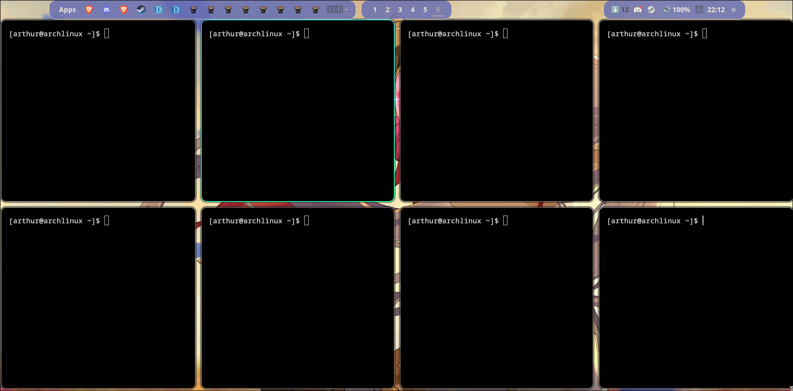

# Arch Linux + Hyprland Rice

Configurações pessoais (aprendendo, meio quebrado ainda)

## Preview 

* **OS:** Arch Linux
* **WM:** Hyprland
* **Bar:** Noctalia-shell
* **Terminal:** Ghostty
* **Shell:** Bash

Conifguração usada pra hardware antigo:
* **CPU:** Intel i5 4th Gen
* **GPU:** GTX 1050 TI